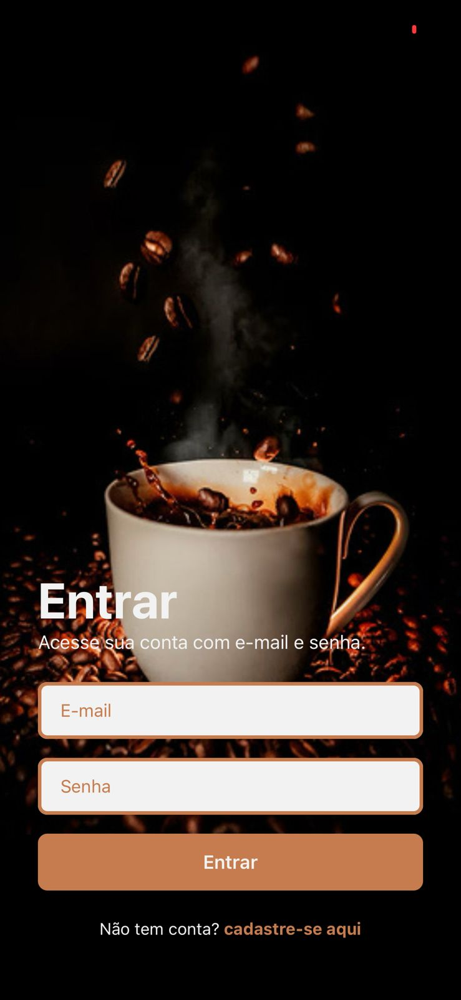
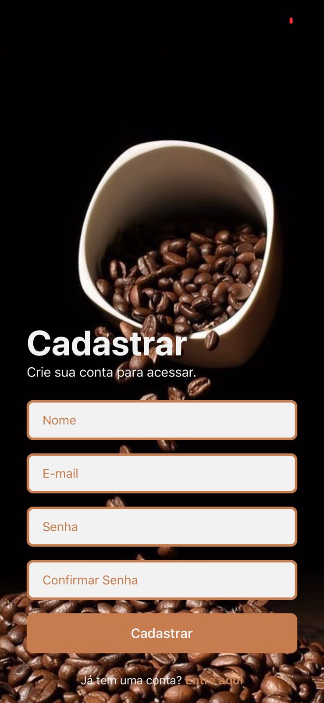
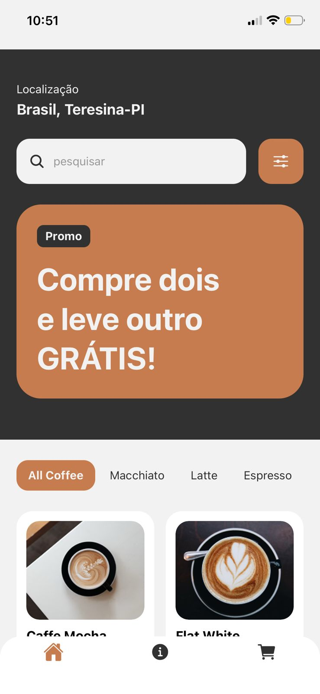
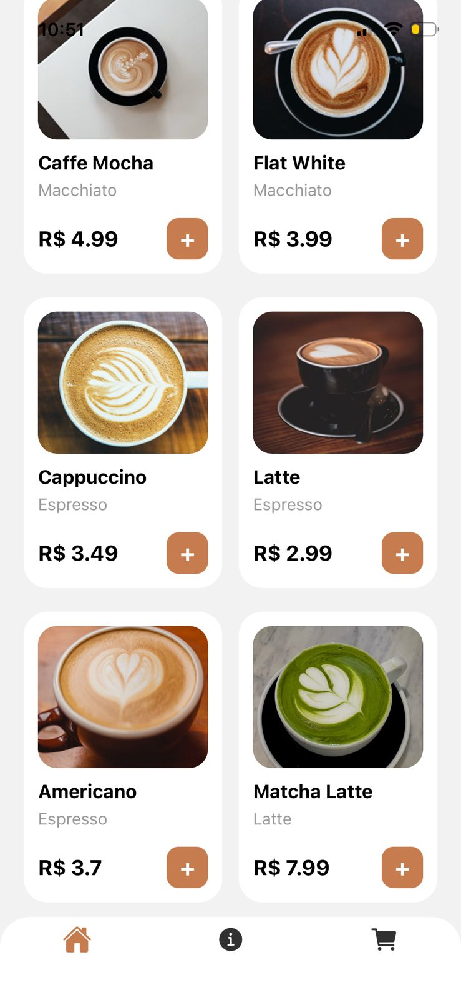
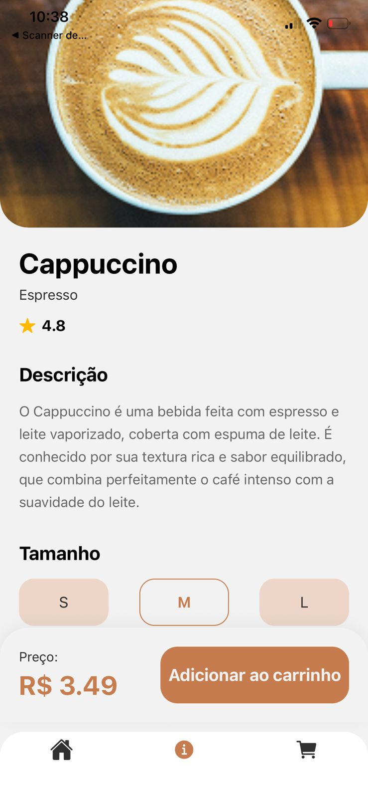
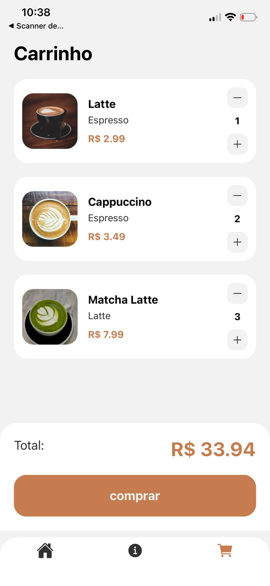

**DESENVOLVIMENTO PARA DISPOSITIVOS MÓVEIS/Programação Mobile Coding**

Aplicativo mobile de cafeteria desenvolvido em React Native utilizando Expo Router.
O sistema possui telas de login, cadastro, home, detalhes do pedido e carrinho de compras, com navegação por tabs, filtragem de cafés, pesquisa dinâmica e gerenciamento de carrinho utilizando Context API.
O projeto foi desenvolvido com foco em organização de componentes, reutilização de código e interface moderna e responsiva.

**membros do grupo**
- Fábio Lucas Ferreira de Castro - 01796226 
- João Pedro Lima Alves - 01791587
- João Victor Lima Alves - João Victor Lima Alves 
- Keila Silva Maia - 01849780
- Kayke de Sousa Figuerêdo - 01797264

## Tela de Login

## Tela de Cadastro

## Tela Home

## Tela de Detalhes

## Tela do Carrinho

